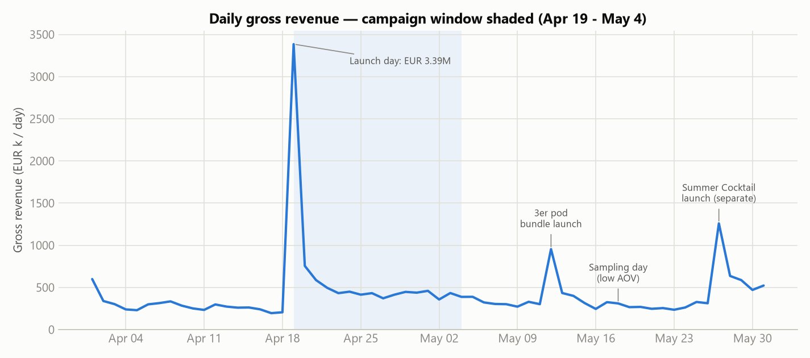
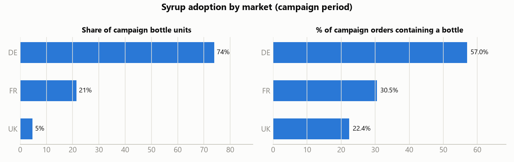
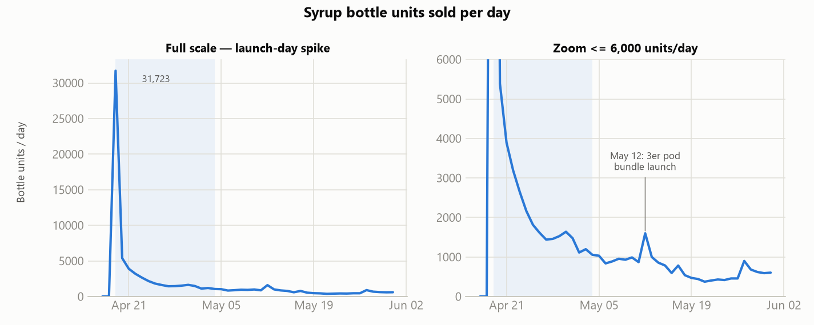
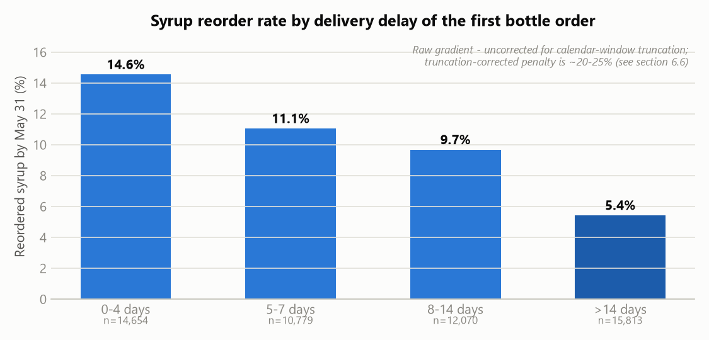

# Q1 — 5th BURRsday Syrup Campaign: Launch Analysis

*Briefing for the Head of Marketing · Data: Apr 1 – May 31, 2026 (DE/FR/UK Shopify) · All monetary figures are **net revenue** (the marketing team's steering metric — additional info provided by Martijn: item revenue + shipping − refunds − tax) and should be read as **relative** comparisons, per the dataset disclaimer.*

> **Data prep:** duplicate orders deduped, cancelled orders excluded (rule provided by Martijn: `refunded_value ≥ gross_revenue`), orphan line items and `10-00-42-002x` spare-part items dropped, delivery delay computed as `delivered_at − order_date`. Details, open questions and the additional info provided by Martijn in [data-quality-review.md](data-quality-review.md).
>
> **Code:** every number in this document is produced by **analysis.ipynb** (in the repository, rendered with outputs on GitHub). Each section below carries a *(code: analysis.ipynb §…)* tag naming the analysis.ipynb section that computes it; the data-cleaning rules are in analysis.ipynb §2.

---

## TL;DR — the five things to know

1. **The launch worked as a demand event.** Campaign net revenue ran at **+118% per day vs. the pre-period** (+57% excluding launch day). Launch day alone did ~€3.1M — 11× a pre-campaign day — and half of all campaign bottle volume. *(details [§2.1](#q1-21), [§2.4](#q1-24) · code: analysis.ipynb §3.1, §3.4)*
2. **It was an existing-customer launch, not an acquisition launch.** Only **22.7%** of syrup-bottle orders came from first-time customers vs. 47.8% for non-syrup orders in the same window. The syrup bottle monetized the base; it did not (yet) bring new people in. *(details [§2.2](#q1-22), [further analysis §3](further-analysis.md#fa-3) · code: analysis.ipynb §3.2, §6.3)*
3. **DE carried it**: 74% of bottle units, 57.0% of DE campaign orders contained a bottle (FR 30.5%, UK 22.4%). FR underperformed its size (+51% net revenue uplift vs. DE +184%). *(details [§2.3](#q1-23) · code: analysis.ipynb §3.1, §3.3)*
4. **The production gap was expensive.** Bottle orders placed in weeks 18–19 waited a **median 38–40 days** for delivery. Reorder rate drops with delay: **14.6% (delivered ≤4 days) → 5.4% (>14 days)** raw; a truncation-corrected check puts the penalty at **roughly a fifth to a quarter lower reorder likelihood (≈1,000 lost reorders — an imprecise estimate)** ([further analysis §6](further-analysis.md#fa-6)). The delays were confined to the **POZ1 warehouse, which fulfils DE/FR** — NOT1 shipped on time throughout, but it serves only the UK, so warehouse and market are confounded ([further analysis §4](further-analysis.md#fa-4)). *(details [§3.3](#q1-33), [further analysis §4](further-analysis.md#fa-4), [further analysis §6](further-analysis.md#fa-6) · code: analysis.ipynb §3.9, §3.10, §6.4, §6.6)*
5. **Early retention is real but shallow:** 10.1% of identifiable campaign bottle buyers re-bought syrup within the observed 4–6 week window (median 23 days to reorder), mostly via the May 12 3er pod bundles — evidence the refill model works. No cannibalisation of the core Energy business is visible. *(details [§4.1](#q1-41), [§4.2](#q1-42) · code: analysis.ipynb §3.10, §3.11, §3.12)*

---

## 1. Setting expectations

### KPIs I would track for a launch like this

| KPI | Why it matters |
|---|---|
| **Adoption / penetration** (% of orders containing the hero SKU; units) | Direct measure of whether the launch landed |
| **Incremental revenue uplift** vs. pre-campaign baseline (total and per market) | Separates "campaign grew the pie" from "campaign relabeled existing demand" |
| **New vs. existing customer mix** of hero-product buyers | Tells you whether the product acquires or monetizes |
| **AOV & attach rate** (pods, consumables, cross-category) | The syrup system is razor-and-blades: the bottle only pays off if consumables attach |
| **Repeat / reorder rate** of hero buyers (30/60/90-day cohorts) | The single most important long-term KPI for a consumable ecosystem |
| **Fulfilment SLA** (days to delivery, % delayed) | Launch experience drives second purchase; we can measure it directly |
| **Category mix shift / cannibalisation** | Guards the core Energy business |
| **CAC / media efficiency** *(not measurable here — no spend data)* | Needed to call ROI, flagged as an open ask |

### What "good" looks like

- **End of campaign:** high penetration among existing customers (the launch audience), strong pods attach (validates the system), demand sustained after the launch-day spike rather than a one-day novelty, and no meltdown in fulfilment.
- **+30 days:** the KPI shifts from adoption to **repeat**. Good = a double-digit share of bottle buyers back for refills within 30 days, refill volume replacing launch hype as the demand driver, and no lasting dent in Energy sales. A first-ever product has no benchmark, so the honest framing is: *set the benchmark now, manage the curve* (which is what the May 12 3er bundle did).

---

## 2. Campaign analysis

### 2.1 Baseline & uplift *(code: analysis.ipynb §3.1)*

| Period | Days | Orders/day | Net €/day | AOV (net) | First-order share |
|---|---|---|---|---|---|
| Pre (Apr 1–18) | 18 | 4,045 | €268k | €66.2 | 46.9% |
| **Campaign (Apr 19–May 4)** | 16 | **7,828 (+94%)** | **€585k (+118%)** | **€74.7 (+13%)** | 36.6% |
| Post (May 5–31) | 27 | 5,392 (+33%) | €372k (+39%) | €69.1 | 40.7% |

- Excluding launch day, the campaign still ran **+50% orders / +57% revenue per day** — the uplift was not just one spike. *(code: analysis.ipynb §3.1)*
- The post-period stays ~39% above pre, but is **contaminated upward** by the May 12 3er launch, a May 18 sampling giveaway and the May 27 Summer Cocktail launch — read it as "elevated, partly for other reasons", not as pure campaign halo. *(code: +39% in analysis.ipynb §3.1; event evidence §1.5 and §3.12; all three annotated in the §4.1 chart)*
- **Robustness:** the pre-period contains Easter (Apr 3–6) and the campaign contains May 1 — re-basing on an Easter-adjusted baseline moves the uplift only from +118% to **+114%** (+54% excl. launch day *and* May 1). Zero-revenue sample orders (11.7k in the post-period, mostly May 18) inflate post *order counts* (+33% → **+24%** when excluded) but not revenue (+39% either way). *(code: analysis.ipynb §3.1 sensitivity checks)*
- **Interpretation (hypothesis):** launch-day concentration (28% of campaign orders in one day) points to a well-primed audience — likely CRM/community activation. That same concentration implies part of the uplift is **demand pull-forward** from the base rather than net-new consumption; separating the two needs a longer horizon or a control market. This analysis can only quantify the **demand uplift** the campaign generated; If it could be paired with the campaign's spend (media, CRM, influencer fees) it would be possible to convert these numbers into true **ROI/ROAS** — this would be the first data request I'd make to complete the launch evaluation. *(code: analysis.ipynb §3.1)*

### 2.2 Existing vs. new customers *(code: analysis.ipynb §3.2)*

- Campaign first-order share **fell** to 36.6% (pre: 46.9%) — the extra demand was disproportionately **existing customers**. *(code: analysis.ipynb §3.2)*
- Bottle orders: **22.7% new** vs. 47.8% for non-bottle orders in the campaign window. *(code: analysis.ipynb §3.2)*
- *Reliability note:* these splits rest on the `is_first_order` flag. The audit initially reported 1,583 customers with two "first" orders; on re-review that was a computation artifact (null `customer_id`s counted as duplicates of each other) — after dedupe **no** customer carries two "first" orders, so the flag is clean. The remaining identity caveat is the 3,450 orders with no `customer_id` at all (data quality review §2.8) — orders of magnitude too small to close the 22.7% vs 47.8% gap. *(code: analysis.ipynb §1.1)*
- **What the data shows:** the syrup launch activated the base. **My interpretation:** that's the right sequencing for a new format (fans forgive teething problems), but H2 needs an acquisition angle for syrup — currently it doesn't pull new customers. *(code: analysis.ipynb §3.2, §6.3)*

### 2.3 Market breakdown *(code: analysis.ipynb §3.3)*

| Market | Net revenue uplift (campaign vs pre, €/day) | Bottle units share | Bottle penetration of campaign orders |
|---|---|---|---|
| DE | **+184%** | 74% | 57.0% |
| UK | +107% | 5% | 22.4% |
| FR | **+51%** | 21% | 30.5% |

FR is the underperformer relative to its base size (FR is ~44% of pre-period net revenue but took only 21% of bottle units). Hypotheses to check with the team: weaker localisation/creator support, price sensitivity, or the campaign being DE-centric by design.

### 2.4 Daily trend *(code: analysis.ipynb §3.4)*

Launch day sold **31,723 bottles — 50% of total campaign bottle volume** — then demand decayed over the following week (5.4k → 1.8k/day) and stabilised at ~1,000–1,600/day from Apr 25 (average ~1,430/day over the final 10 days; ~2,100/day across the whole post-launch stretch including the decay days), settling at ~720/day on average post-campaign with a clear bump on May 12 (3er launch). The demand curve is a classic hype-then-baseline launch; the late-May run-rate (~500–600 bottles/day) is the number to plan production against.

### 2.5 Category mix *(code: analysis.ipynb §3.5)*

Share of net revenue by category:

| Category | Pre | Campaign | Post |
|---|---|---|---|
| Syrup Bottle + Syrup Bundle (pods) | 0% | **34.2%** | 13.4% |
| Energy (bundle + sachet + box) | 29.2%* | 21.8% | 28.6%* |
| Mixed Sachetbox | 27.3% | 14.7% | 17.3% |
| Hydration Bundle | 15.3% | 10.5% | 14.3% |
| Iced Tea Bundle | 12.3% | 9.0% | 11.0% |

*\*Energy rows shown as the share of the three energy categories combined; full table in analysis.ipynb §3.5.*

The syrup franchise instantly became the #1 category during the campaign — in net terms the standard-VAT bottle weighs slightly less than the food-VAT consumables, so the **Energy Bundle** category edges the Syrup Bottle as the largest *single* category (20.2% vs 18.8%), but bottle + pods combined lead clearly at 34.2% — and it **retains ~13% of revenue after the campaign**, a real second leg, not a stunt. Energy's *share* dipped during the campaign but its **absolute net €/day grew** (€78.3k pre → €127.6k campaign → €106.7k post), so the dip is denominator effect, not decline (see cannibalisation, [§4.2](#q1-42)).

---

## 3. Products deep dive

### 3.1 Adoption & buying behaviour *(code: analysis.ipynb §3.6, §3.7)*

- **44.7% of all campaign orders (55,982 of 125,252) contained a syrup bottle**; 63,356 bottles sold in 16 days. *(code: analysis.ipynb §3.6)*
- Flavour split: **Darko 49% · Syru 34% · Raptor 17%** — consistent enough that no flavour flopped, skewed enough to plan production toward Darko. *(code: analysis.ipynb §3.6)*
- **Every bottle was sold as part of a fixed bundle** (100% `is_bundle`) that included the 10er pods (99.8%) and usually a sticker (81%). Those "attach rates" are therefore **offer architecture, not customer choice** — the behavioural signals are that standalone bottles effectively weren't sold, only 94 pod packs went out *without* a bottle, and every owner starts the refill loop (§4.1). *(code: analysis.ipynb §3.6)*
- 88% of bottle orders took exactly one bottle (mean 1.13) — one bottle per household; multi-bottle gifting didn't materialize. *(code: analysis.ipynb §3.7)*
- **Bottle orders spend more:** AOV (net) €81.3 vs €69.4 for campaign non-bottle orders (+17%; the premium is larger in gross terms, +23% — the bottle is standard-VAT hardware while consumables carry food VAT). *(code: analysis.ipynb §3.7)*

### 3.2 Cross-purchase *(code: analysis.ipynb §3.8)*

Among bottle orders (besides the bundled pods/sticker): **30% added a Shaker, 24% Merch, 16% an Energy tub**, 9% Iced Tea, 9% Hydration. Only 0.1% bought the bottle bundle alone. Syrup buyers are engaged multi-category customers — supports the "monetize the fans" read.

### 3.3 Delivery delay impact — the costliest lesson of the launch *(code: analysis.ipynb §3.9)*

Bottle orders were dramatically slower than the rest of the shop:

| | Median delay | % > 7 days | % > 14 days |
|---|---|---|---|
| Campaign bottle orders | **8 days** | **51.6%** | **29.5%** |
| Campaign non-bottle orders | 4 days | 14.7% | 0.7% |

By order week, bottle orders placed in **weeks 18–19 (Apr 27 – May 10) waited a median 38–40 days** — the production gap hit customers who ordered late in the campaign; service recovered to ~5 days by week 20.

Reorder rate falls monotonically with the delay on the *first* bottle order: **14.6% → 11.1% → 9.7% → 5.4%**. Holding the ≤4-day rate as the counterfactual, the naive estimate is **~2,400 lost reorder customers (~4.4pp of cohort retention)**.
*Correction (see [further analysis §6](further-analysis.md#fa-6)):* part of this gradient is calendar truncation — late-delivered customers had fewer days left to reorder before the data ends. A fixed 21-day-after-delivery window puts the **penalty at roughly a fifth to a quarter lower reorder likelihood, ≈1,000 lost reorders** — material, about half the naive read, though imprecisely estimated: the corrected gradient is not fully monotonic, so composition effects remain.

---

## 4. After the campaign

### 4.1 Retention & reorders *(code: analysis.ipynb §3.10, §3.12)*

Of **54,127 identifiable campaign bottle buyers**:

- **10.1% (5,470) re-purchased syrup by May 31** (window: 4–6 weeks); median time to reorder **23 days** — consistent with a ~3-week consumption cycle for the bundled 10er pods. *(code: analysis.ipynb §3.10)*
- **Internal benchmark:** campaign buyers of the core Energy category re-bought energy at **10.4%** in the same window, once bottle buyers are excluded from the benchmark cohort to keep it independent (they are ~30% of it and repeat at 15.3% — the same engaged multi-category fans; 11.8% unadjusted). Syrup's 10.1% first-cohort repeat, achieved despite the delivery crisis, is therefore **essentially at core-category level** (identical campaign → May 31 clock, same window truncation). *(code: analysis.ipynb §3.10)*
- What they reordered: **3er pod bundles 3,992 · bottles 2,072 · 10er pods 1,978** (overlapping) — overwhelmingly **consumable refills**: the 3er is a *pod* bundle, not more hardware (naming confirmed against the product master). The May 12 3er launch was well-timed against the consumption cycle and immediately became the main reorder vehicle (3,365 orders on day one). *(code: analysis.ipynb §3.10, §3.12)*
- 3er bundle buyers since May 12: 10,215 orders, only **9.4% first-time customers**, and **42.4% verifiably owned a bottle already** — it is functioning as a retention product, as intended. (The other ~58% may have bought bottles before Apr 1, via another channel, or are gift buyers — worth checking, and one of my interviewer questions.) *(code: analysis.ipynb §3.12)*
- Reorder flavour ranking by units (Peach and Cola Ice Pop neck-and-neck at ~15% each, Green Apple third) is the first read on which refill flavours to scale. *(code: analysis.ipynb §3.12)*

### 4.2 Cannibalisation risk *(code: analysis.ipynb §3.11)*

**No evidence of cannibalisation so far — if anything the opposite:**

- Energy absolute net revenue per day *rose* pre → post (+36%). *(code: analysis.ipynb §3.5)*
- Cohort comparison: existing customers who bought a bottle grew their energy spend/day **+73%** pre→post, vs **+51%** for existing campaign customers who didn't buy a bottle. *(code: analysis.ipynb §3.11)*

**Interpretation with caveats:** syrup looks complementary (different consumption occasion) rather than substitutive. But the post window is short, seasonal, and boosted by other launches; the honest verdict is "no early warning signs", to be re-checked on a 90-day horizon — the real risk is *share-of-stomach* over months, not weeks. Note also that both cohorts condition on a campaign purchase, but bottle buyers *self-selected* as the most engaged fans — read the +73% vs +51% contrast as the absence of a warning sign, not as a causal effect size.

### 4.3 What worked / what to fix / open questions

**Worked:** launch-day activation of the base (28% of campaign orders in one day); bundle architecture (100% pods attach = every bottle owner starts the refill loop); the May 12 3er bundle timed to the refill cycle; a durable post-campaign syrup baseline (~13% of revenue).

**Needs improvement:**
1. **Fulfilment readiness** — the production gap measurably burned early retention (~1,000 reorders on the corrected estimate, [further analysis §6](further-analysis.md#fa-6)) and it was confined to POZ1, the DE/FR warehouse ([further analysis §4](further-analysis.md#fa-4) — note the warehouse/market confound); late-campaign buyers had a first experience of waiting 5+ weeks.
2. **FR performance** — +51% uplift vs DE's +184%; diagnose localisation/creator mix before H2.
3. **New-customer angle** — syrup didn't acquire; consider a syrup-led acquisition offer now that the base is saturated with bottles.

**Couldn't answer with this data (and what I'd need):**
- **Campaign ROI** → media spend & channel attribution for the window.
- **True incrementality of launch-day demand** (pull-forward vs. net-new) → longer pre-period / prior-year baseline.
- **Retention beyond 4–6 weeks & pods consumption rate** → June+ orders; subscription data if any.
- **Margin** impact of the bundle discount → COGS/discount data (net revenue in the extract is unreliable — see data review).
- Whether **delivery-delay victims** should get a win-back voucher (I'd A/B it — the ~15.8k identifiable customers who waited >14 days are a named, reachable audience).

---

## 5. Further analysis — beyond the brief's guiding questions

Seven additional analyses that sharpen — and in one case revise — the findings above are documented separately in **[further-analysis.md](further-analysis.md)**: refunds & cancellations, the May 18 sampling giveaway's conversion, new-customer cohort quality, the warehouse split of the delivery delays, the habit-formation effect, the truncation-corrected delay estimate (which cut the lost-reorders figure from ~2,400 to ~1,000), and a refill-demand planning number. *(code: analysis.ipynb §6)*

---

*Time spent: ~5 hours on Q1 (audit, analysis, charts, further analyses, write-up). Project total including Q2, the re-runs on Martijn's additional info and the adversarial self-review: ~7 h — full time log in the project blueprint. Fully scripted in Python/pandas for reproducibility.*
